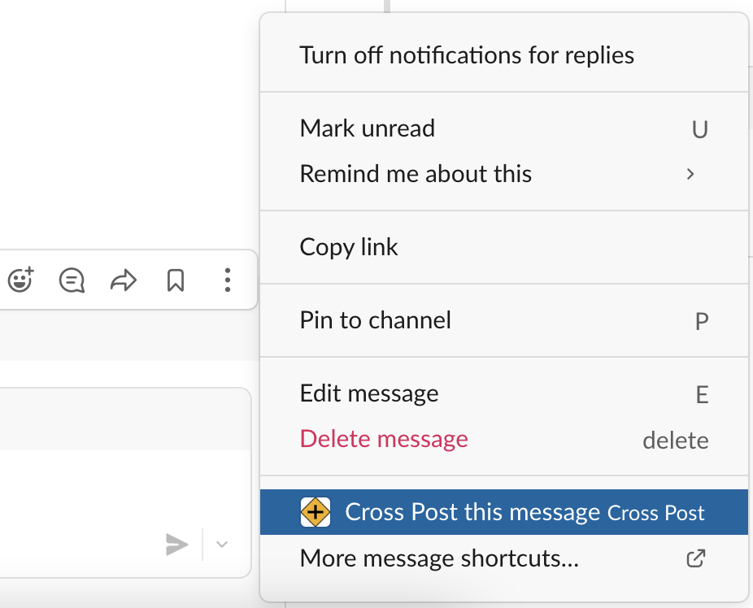
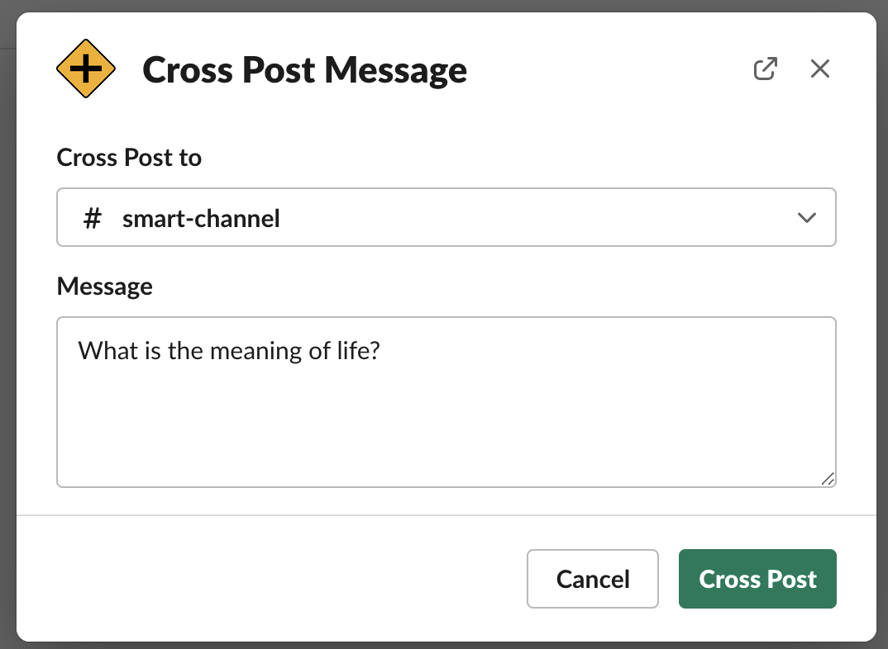
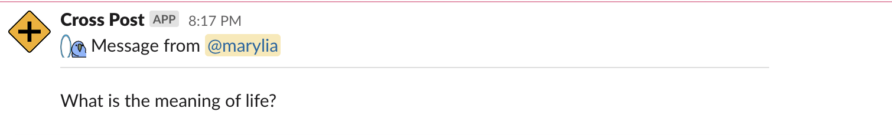
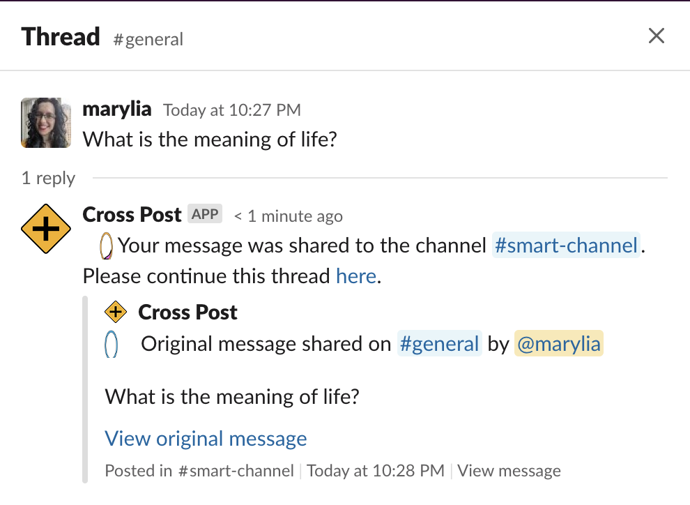
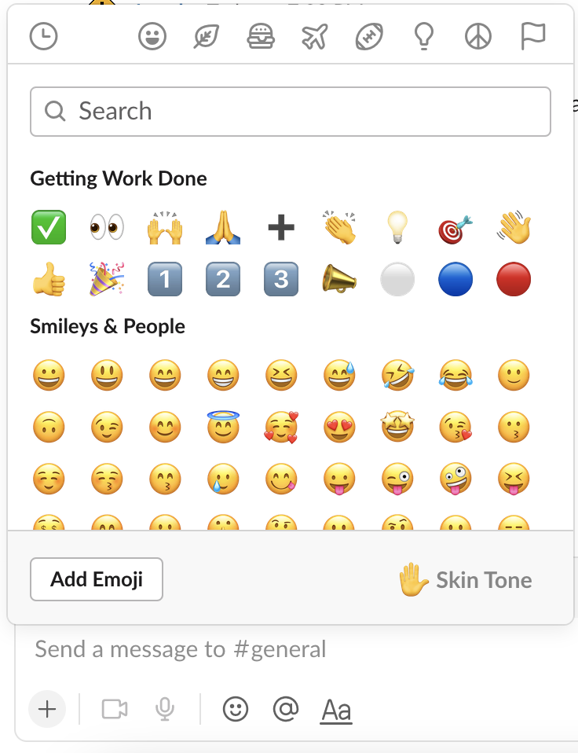
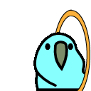
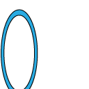

# cross-post 

Slack App for cross posting messages to a different channel.

When someone asks a question on a channel, but that was not the right channel to ask, 
someone might share the message to another channel, but some people might reply to the original thread while
others might reply on the shared one, causing a misalignment in communication.

This Slack App was created to help this problem. The message is shared to the new
channel and a message on the original thread is sent to indicated to where the conversation was
moved to and where it should continue.

## Usage
- Click on `More Actions` on the message you want to share (you don't have to be the author)  

- Select the channel you want to share and add any new info if you want   

- The Message will show up on the new channel  

- The confirmation message will show up on the original message  

## Setup
### Create the App on Slack
- Go to https://api.slack.com/apps/ and click on `Create App`  
- Add a name (`Cross Post`) and a description (`Cross Post messages to another channel`)   
- Add an image (You can use the `crossroad.png` file from the `images` folder)  
- Copy the values for `SLACK_SIGNING_SECRET` and `SLACK_BOT_TOKEN` (you will add them to the `.env` file)

### Add Permissions
- Go to OAuth & Permissions
- Add the scopes: `chat:write`, `users:read`, `chat:write.public`, `channels:read`

### Connect your App to Slack
- Go to the Interactivity & Shortcuts and turn it on
- Add the URL for your App
- Add shortcut > on messages
- Add name (`Cross Post this message`) and description (`Cross Post this message to another channel`) 
- Add a callback id (`crosspost`)

### Add the emojis to Slack
- Click on the emoji on your input area and `Add Emoji`  
  
- Using the images from the `images` folder, add `parrot-in`  and `parrot-out`  to your Slack, using those exact names.  

### To test locally
- Install node and ngrok
- Start your app with `npm start`
- Start your tunnel with `ngrok http 6000` (or whatever port you used on `index.js`)
- Update the URL on Interactivity & Shortcuts to point to the URL created on the previous step

(Note: the tunnel has a session, e.g. 2h, so make sure it's still up when you're testing)
