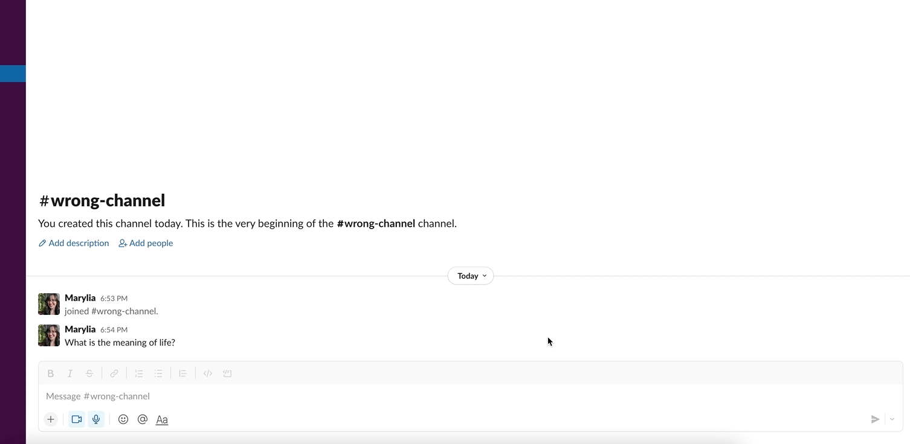
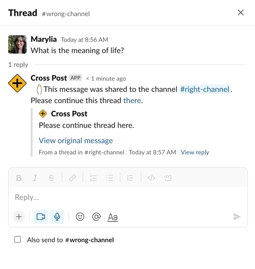
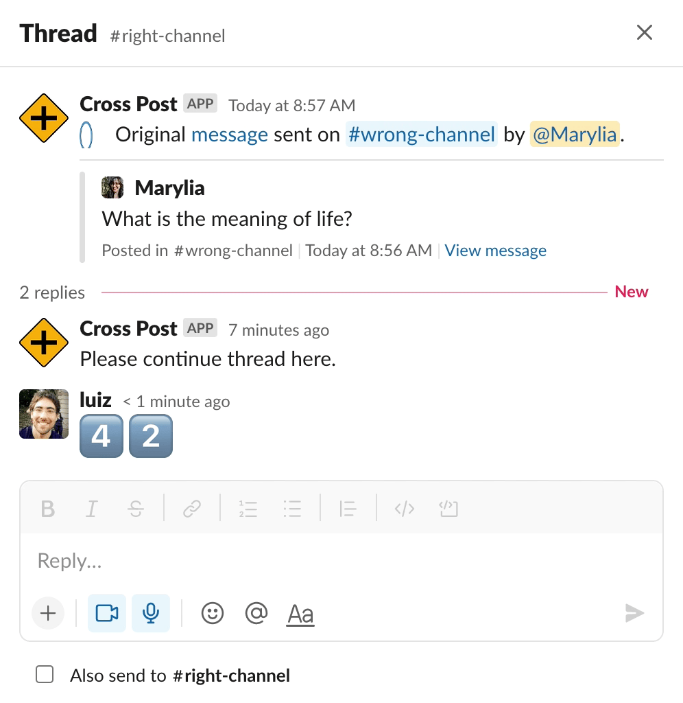

# Cross Post 

Slack App for cross posting messages to a different channel.

When someone asks a question in a channel, but that was not the right channel to ask, 
what do you do? Share the message to the right channel!  

But now you have people replying to the original message and others replying to the 
shared message, no one knows what is going on! It's chaos!! Help! :scream:

Don't worry, **Cross Post** is here to help you!

Now the message is shared to the correct channel and another message is sent to 
the original thread to indicate where the conversation should continue! Chaos no more!
:smile:

## Usage
1. Click on `More Actions` on the message you want to share (you don't have to be the author) and select the channel you want to share 

2. The Message will show up in the new channel with a new thread created 

3. The confirmation message will show up in the original message with the link for the thread reply 

4. And now people can reply to the right thread


## Setup
### Create the App on Slack
1. Go to https://api.slack.com/apps/ and click on `Create App` and select your workspace  
2. Add a name (`Cross Post`) and a description (`Cross Post messages to another channel`)   
3. Add an image (You can use the `crossroad.png` file from the `images` folder) and background color (`#000000`)  
4. Copy the value for `Signing Secret` and add it to the `.env` file with key `SLACK_SIGNING_SECRET`  

### Add Permissions
1. Go to `OAuth & Permissions` 
2. On the `Scopes` section, under `Bot Token Scopes` add the scopes: `chat:write`, `users:read`, `chat:write.public`, `channels:read`
3. On the `OAuth Tokens for Your Workspace` section, click on `Install to Workspace`
4. Copy the value of `Bot User OAuth Token` (it should start with `xoxb-`) and add it to `.env` file with key `SLACK_BOT_TOKEN`

### Connect your App to Slack
1. Go to the `Interactivity & Shortcuts` and turn it on
2. Add the URL for your App ending with `/slack/events`, e.g. `https://example.ngrok.io/slack/events`
3. Click on `Create New Shortcut` and select `On messages`
4. Add name (`Cross Post this message`) and description (`Cross Post this message to another channel`) 
5. Add the callback id `cross_post`
6. After some of these steps, you might get a warning that you will need to re-install your App, so go to `Install App` and click on `Reinstall to Workspace`

### Add the emojis to Slack
1. Click on the emoji on your input area and `Add Emoji`  


2. Using the images from the `images` folder, add `parrot-in`  and `parrot-out`  to your Slack, using those exact names.  

### To test locally
1. Install node and ngrok
2. Create a `.env` file and add the values for `SLACK_SIGNING_SECRET` and `SLACK_BOT_TOKEN`
3. Start your app with `npm start`
4. Start your tunnel with `ngrok http 6000` (or whatever port you used on `index.js`)
5. Update the URL on `Interactivity & Shortcuts` to point to the URL created on the previous step

(Note: the tunnel has a session, e.g. 2h, so make sure it's still up when you're testing)

### Production
You can host your App anywhere, on this example I hosted on GCP Cloud Functions.
1. Create an Organization and a Project
2. Inside your project click on `Create Function`
3. Add function name (`cross-post`)
4. On `Trigger` change to `Allow unauthenticated invocations` (you can leave everything else as default or change as necessary)
5. Open `Runtime, build, ...` and click on `Add Variable`
6. Add `SLACK_SIGNING_SECRET` and `SLACK_BOT_TOKEN` with the values you saved from previous steps
7. Click on Next
8. Update the `package.json` and `index.js` files to the ones from the `src` folder
9. On the `index.js` you can remove the part that is not necessary on Cloud Functions
```
(async () => {
    await app.start(process.env.PORT || 6000);
    console.log('Cross Post app is running!');
})();
```
10. Add the `actions.js` and `payloads.js` files also from the `src` folder
11. Make sure `Runtime` has `Node.js` selected
12. Change `Entry Point` to `slack`
13. Click on Deploy :tada:
14. If anything goes wrong you can check in the logs


